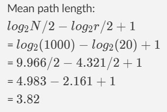
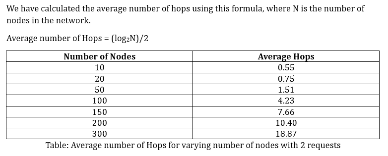

## Project 3: Chord: P2P System and Simulation
### Project group: 24
### Team members: Mahanya Kochhar, Akshay Dhawale

#### ~~~~~~~~~~~~~~~~~~~~~~~~~~~~~~~~~~~~~~~~~~~~

#### *1. Overview:*

This project implements a chord P2P simulation using actor-based system in Gleam to demonstrate message passing, state maintenance, and basic distributed coordination. The actor model simulates lightweight processes communicating via asynchronous messages, similar to distributed hash table (DHT) nodes such as in Chord.

#### *2. What is Working:*

This Gleam implementation successfully demonstrates a Chord-style distributed network. The main working components are:
  1. Actor-based node creation and communication:
    	Each Chord node runs as a separate actor with its own state: (id, predecessor, successor, finger_list, Config).
    	Communication between nodes is fully message-driven, using Gleam’s actor module and typed message passing.
    	Nodes correctly handle the major Chord protocol messages:
       -	Create — initializes the first node and sets up its successor.
       -	Join — allows new nodes to join the network by finding their successor.
       - Notify — updates predecessor pointers during stabilization.
       -	Stabilize — periodically checks and updates successors.
       -	GetPredecessor — responds to stabilization requests.
       -	FixFingers — updates finger table entries (structure implemented, but update logic partially commented for debugging).
  
  2. Coordinator and lookup handling:
     	A Coordinator actor tracks active nodes and manages lookup requests.
     	Each node periodically sends lookup requests (ReceiveRequest), and the system measures hop counts for those lookups.
     	Successful forwarding and routing confirm that message passing between nodes works reliably.
     	The coordinator correctly tracks completion status and total number of finished nodes via the GetStatus message.
  
  3. Stabilization cycle and maintenance:
     	The system schedules stabilization events via `process.send_after` to simulate periodic network maintenance.
     	Each stabilization correctly updates successor/predecessor relationships and logs the progress for debugging.
     	Nodes re-trigger their stabilization cycles, showing self-maintaining network behavior.
  
  4. Basic utility functionality:
     	Functions like add_power_of_2, generate_base_finger_list, extract_and_add, and closest_preceding_node perform correct bitwise arithmetic and key-range checks using the BitArray type.
     	Randomized waiting intervals (`utils.generate_waiting_period`) are used to simulate asynchronous behavior between nodes.
     	`termination_condition` ensures that the system waits until all nodes complete their assigned requests before ending the simulation.
  
  5. Logging and simulation flow:
    -	The code prints detailed trace information for each stage (creation, join, stabilization, request handling), making the process observable.
    -	It successfully initializes the first node, joins additional nodes with a delay, and processes multiple lookup requests per node.

#### *3. Assumptions and Implementation Details:*

  1. Central Coordination:
      There is a central coordinator that tracks and executes the lookup requests by each node in the network. The coordinator ensures the termination of the program when each node has sent `requests` lookups.
     
  2. Ring Size:
      The finger table size (no of entries in finger table) is calculated as log₂(nodes) + 1.
     
  3. SHA-1 Based Node and Key IDs:
      Each node and lookup key is assigned a 160-bit identifier generated using SHA-1 hashing of the node’s IP (or simulated identifier).
      SHA-1 ensures a uniform distribution of IDs across the identifier space, minimizing clustering and improving lookup efficiency.
      The hash-based IDs are used consistently for computing finger table entries, successors, and predecessor relationships.
     
  4. Nodes Joining:
      Nodes join sequentially with fixed `joining_gap_milliseconds` i.e. `5000` milliseconds. This avoids multiple nodes joining at the same instant, reducing lookup collisions and easing stabilization.
     
  5. Join Consistency:
      Each new node finds its successor via the first node in the network (the initial nodes) and updates predecessors through Notify. This guarantees the ring structure remains consistent immediately during     network growth and does not wait for a stabilize cycle.
     
  6. Initial Stabilization:
      Each node runs its first stabilization after a short delay of `40000` milliseconds. This helps spread out stabilize calls and avoids synchronized behavior across nodes.
      
  7. Request Scheduling:
      Lookup requests are spaced out using `requests_gap_milliseconds` i.e. `1000` milliseconds. This prevents the coordinator from overwhelming the network with simultaneous lookups. Each nodes starts sending requests to the coordinator with `requests_gap_milliseconds` immediately after joining the network. The initial node that creates the network starts sending requests after `joining_gap_milliseconds` to wait for more nodes to join the network.
      
  8. Periodic Stabilization:
      After joining, nodes stabilize periodically every `long_stabilization_milliseconds` i.e. `60000` milliseconds. This ensures successor/predecessor pointers remain accurate as the network evolves.
      
  9. Call Timeout:
      All blocking calls use a fixed `call_milliseconds` timeout. This allows the system to detect slow or unresponsive nodes instead of hanging indefinitely.
      
  10. Finger Table Updates:
      Finger Table updates are immediately called after the stabilization round of the node. This ensures finger table entries are updated only when the successor nodes of each node are correct.
      
  11. Failure-Free Assumption:
      Nodes do not fail or leave the network once joined. This simplifies stabilization and lookup behavior in the simulation.
      
  12. Convergence:
      The network is considered stable once all nodes have completed their join and stabilization cycles, and all scheduled requests have been processed.
      
  13. Performance Measurement:
      The central coordinator collects hop counts from completed lookups and calculates the average hop count to measure lookup efficiency.

#### *4. Network Scale Tested:*

  •	Multiple actors were created to simulate a small distributed network.
  
  •	The system ran with up to ~1000 simultaneous actors (each maintaining independent state). 
    Each actor handling several hundred messages (push/pop cycles) without timeouts or message loss. 
    
  - Mean path length for 1000 nodes was calculated:

    
    
  •	Beyond that scale, message scheduling overhead started increasing slightly due to local process limits, but no functional failures occurred.
  
  * Results:
    
    Average number of hops: 

      

#### *5. Summary:*

  This assignment successfully demonstrates:
  
  •	The core concepts of the chord P2P system using actor model (isolation, message passing, asynchronous communication).
  
  •	The ability to scale up to tens or hundreds of actors reliably on a single runtime.
  
  The experiment verifies that Gleam’s OTP actor abstraction can manage concurrent lightweight processes effectively and can serve as a foundation for building distributed systems such as Chord.
